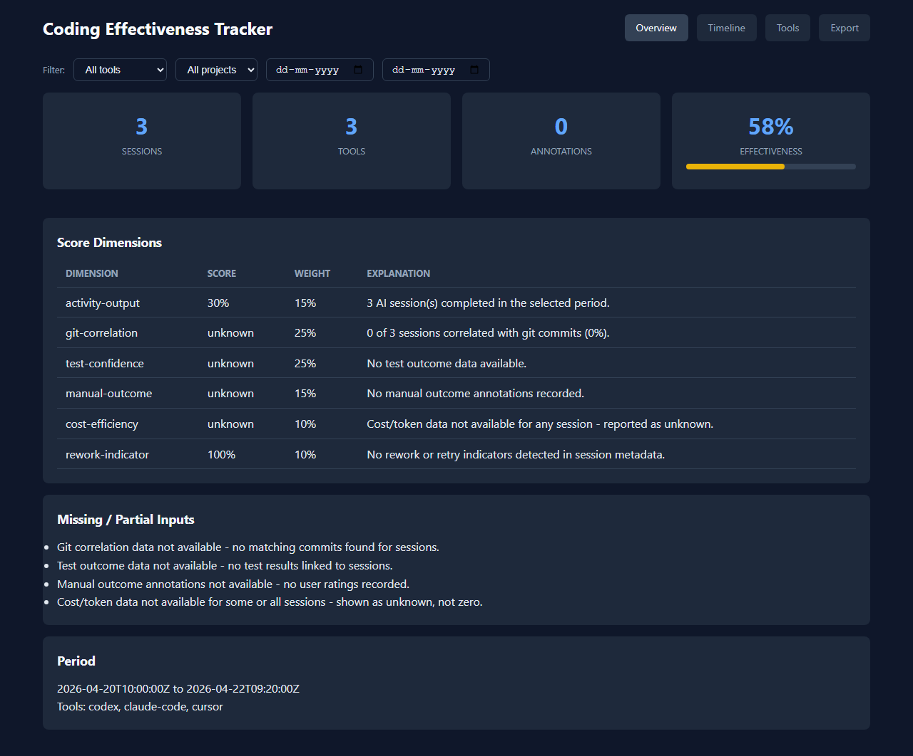
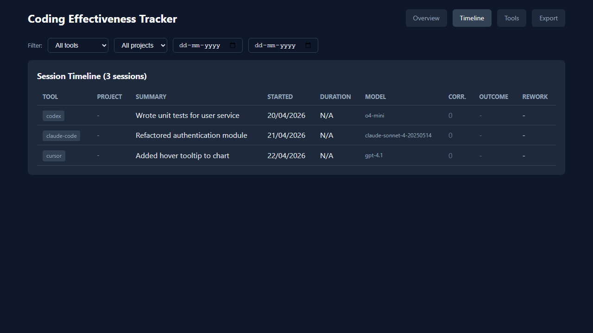
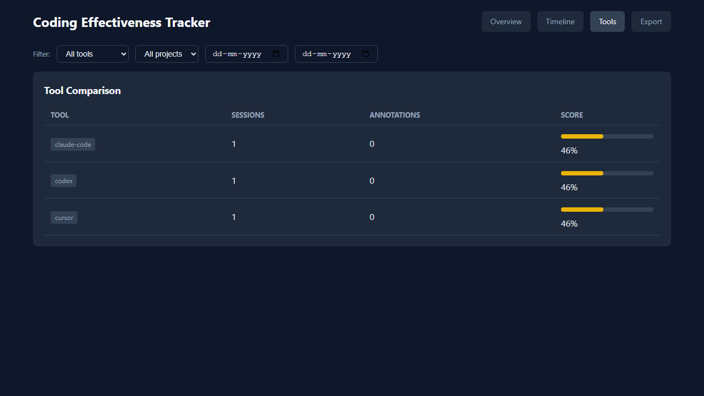

# Coding Effectiveness Tracker

<p align="center">
  <a href="https://www.npmjs.com/package/coding-effectiveness-tracker"></a>
  <a href="LICENSE"></a>
  <a href="package.json">=18"></a>
  <a href="https://github.com/TafheemMalik/coding-effectiveness-tracker/actions"></a>
</p>

Local-first personal tracker for understanding whether AI-assisted coding workflows are effective. It imports and correlates sessions from Claude Code, Codex, OpenCode, Factory Droid, and Cursor with local Git commits, test outcomes, manual annotations, reports, a local dashboard/API, and privacy-safe exports.

---

## Table of Contents

- [Privacy and Local-First Design](#privacy-and-local-first-design)
- [Prerequisites](#prerequisites)
- [Install, Build, and Test](#install-build-and-test)
- [Quick Start](#quick-start)
  - [Initialize](#1-initialize)
  - [Import Fixture Data](#2-import-fixture-data)
  - [Import from a Tool](#3-import-from-a-tool)
  - [Sync with Git](#4-sync-with-git)
  - [Annotate Sessions](#5-annotate-sessions)
  - [Generate a Report](#6-generate-a-report)
  - [Start the Dashboard](#7-start-the-dashboard)
- [CLI Command Reference](#cli-command-reference)
- [Dashboard, API, and Exports](#dashboard-api-and-exports)
- [Data Directory](#data-directory)
- [Documentation](#documentation)

---

## Privacy and Local-First Design

Coding Effectiveness Tracker stores data on your machine and runs the dashboard/API on loopback (`127.0.0.1`). It does not provide cloud sync, telemetry, or a hosted backend. Import discovery is explicit opt-in, and verbose import output is designed to redact secrets and prompts.

## Prerequisites

- Node.js 18 or newer
- npm
- Git, if you want to sync commit history from local repositories

## Install, Build, and Test

```powershell
npm install
npm run build
npm test
```

During development, run the CLI directly with:

```powershell
npm run dev -- --help
npm run dev -- init
```

After building or installing globally, the CLI command is `cet`.

## Quick Start

### 1. Initialize

Initialize the local workspace and SQLite database:

```powershell
cet init
```

### 2. Import Fixture Data

Try the tool with bundled sample data:

```powershell
cet import --fixture tests/fixtures/sessions-fixture.json
```

### 3. Import from a Tool

Import sessions from a supported local AI coding tool:

```powershell
cet import --tool claude-code --discover
```

Supported tools: `claude-code`, `codex`, `opencode`, `cursor`, `factory-droid`.

### 4. Sync with Git

Correlate sessions with a local Git repository:

```powershell
cet sync --repo C:\path\to\repo
```

### 5. Annotate Sessions

Add a manual outcome annotation:

```powershell
cet annotate --session <session-id> --outcome shipped --score 1 --note "Merged with tests passing"
```

### 6. Generate a Report

Generate an effectiveness report:

```powershell
cet report
```

### 7. Start the Dashboard

Start the local dashboard and API server:

```powershell
cet serve
```

## CLI Command Reference

| Command | Purpose |
| --- | --- |
| `cet init [--data-dir <path>] [--force]` | Initialize the local tracker workspace and database. |
| `cet import [--tool <id>] [--source <path>] [--fixture <path>] [--discover] [--dry-run] [--verbose]` | Import AI coding sessions from Codex, OpenCode, Claude Code, Cursor, or Factory Droid. |
| `cet sync --repo <path> [--project <id>]` | Read local Git commits and correlate them with imported sessions. |
| `cet test-outcome [--outcome-json <path>] [--command <str>] [--passed <n>] [--failed <n>] [--skipped <n>] [--duration <ms>]` | Ingest local test result artifacts or command outcome records. |
| `cet annotate --session <id> [--outcome <label>] [--score <number>] [--note <text>] [--tags <tags>]` | Record a manual outcome annotation for a session. |
| `cet report [--json] [--tool <id>] [--project <id>] [--from <date>] [--to <date>]` | Generate an effectiveness report from imported data. |
| `cet serve [--port <port>]` | Start the local dashboard and API server on `127.0.0.1`; default port is `43187`. |
| `cet export --output <path> [--format json\|markdown] [--overwrite] [--tool <id>] [--project <id>] [--from <date>] [--to <date>]` | Export an effectiveness report to a local file. |

Most commands also accept `--data-dir <path>` to use a custom tracker data directory.

For detailed CLI reference, see [docs/cli-reference.md](docs/cli-reference.md).

## Dashboard, API, and Exports

Run `cet serve` and open the printed local address to view the dashboard. The local API includes:

- `GET /health`
- `GET /api/overview`
- `GET /api/timeline`
- `GET /api/tools`
- `GET /api/projects`
- `GET /api/sessions/:id`
- `POST /api/sessions/:id/annotations`
- `PATCH /api/annotations/:id`
- `GET /api/export/json`
- `GET /api/export/markdown`

Use query filters such as `tool`, `project`, `from`, `to`, and `raw=true` where supported. For file exports, use `cet export --format json --output report.json` or `cet export --format markdown --output report.md`.

For detailed API reference, see [docs/api-reference.md](docs/api-reference.md).

## Dashboard Screenshots

<p align="center">
  
  <br><em>Overview page — aggregate score, session stats, and score dimensions</em>
</p>

<p align="center">
  
  <br><em>Timeline page — session history with correlation and outcome data</em>
</p>

<p align="center">
  
  <br><em>Tools page — per-tool comparison of sessions, annotations, and effectiveness scores</em>
</p>

## Data Directory

By default, tracker data is stored in `%LOCALAPPDATA%\coding-effectiveness-tracker` on Windows and `~/.coding-effectiveness-tracker` on other platforms. Override this with `--data-dir <path>` or the `CET_DATA_DIR` environment variable. The data directory contains the local SQLite database plus importer, export, and correlation subdirectories.

For more information about the data model, see [docs/data-model.md](docs/data-model.md).

## Documentation

Comprehensive documentation is available in the [docs/](docs/) folder:

- [Architecture](docs/architecture.md) — System components, data flow, and key patterns
- [Development Guide](docs/development.md) — Setup, build/test, project structure, cross-platform notes
- [CLI Reference](docs/cli-reference.md) — All 8 CLI commands with options and examples
- [API Reference](docs/api-reference.md) — All 10 API endpoints with query parameters and response shapes
- [Data Model](docs/data-model.md) — Database tables, columns, indexes, and relationships
- [Importer Guide](docs/importer-guide.md) — ToolImporter interface, registration, and privacy redaction
- [Privacy](docs/privacy.md) — Local-first architecture, telemetry, and redaction pipeline
