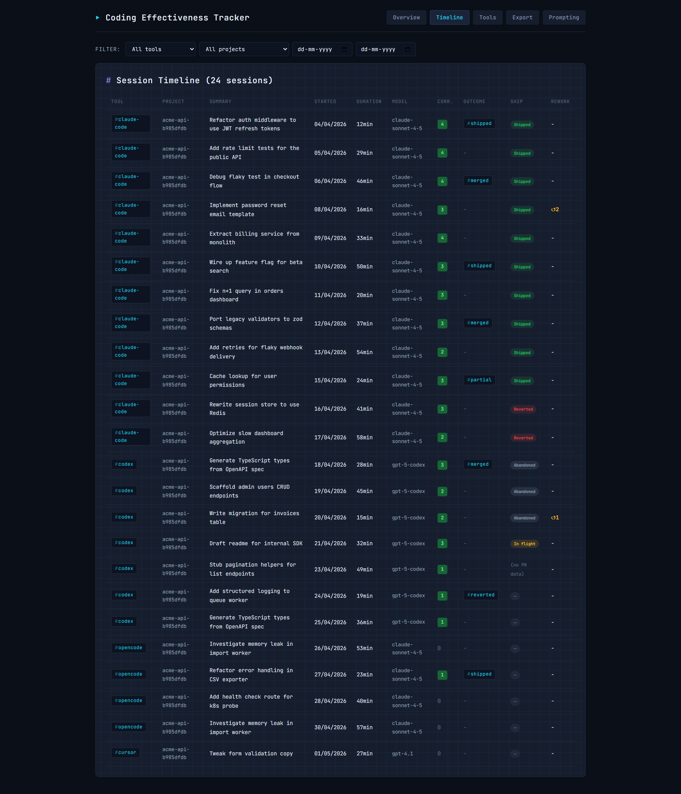
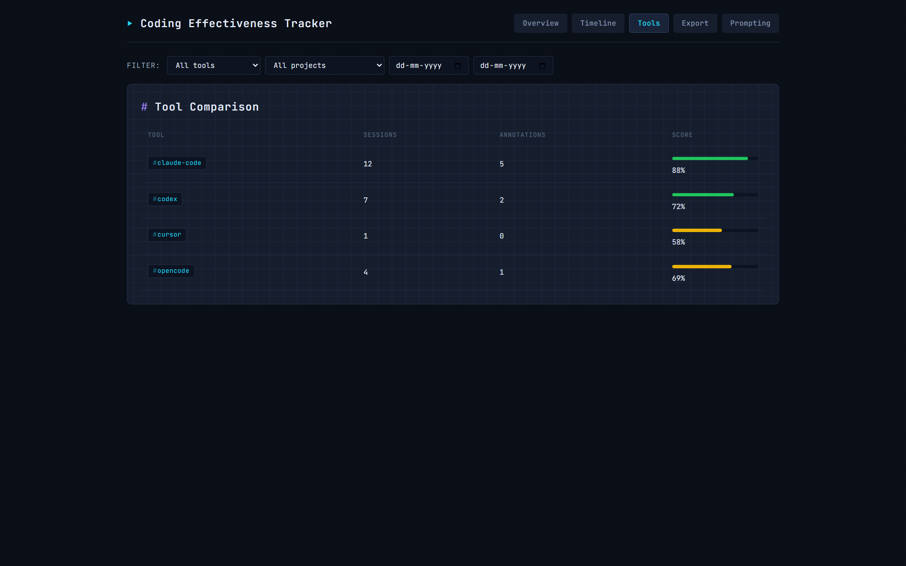
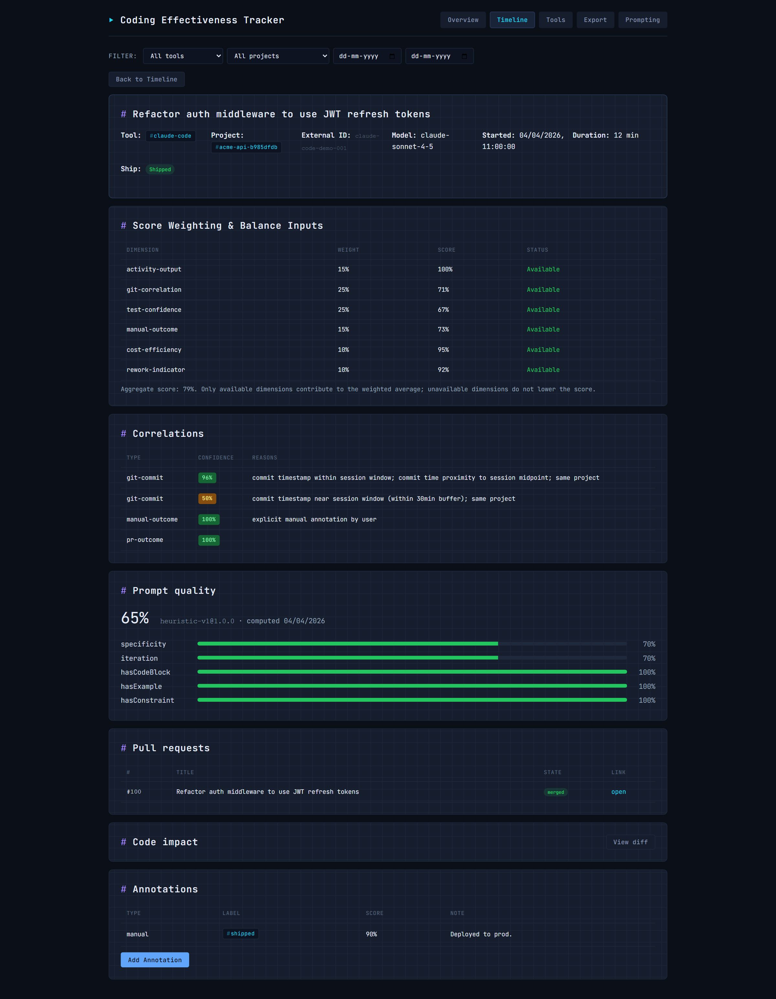

# Coding Effectiveness Tracker

<p align="center">
  <a href="https://www.npmjs.com/package/coding-effectiveness-tracker"></a>
  <a href="LICENSE"></a>
  <a href="package.json">=20"></a>
  <a href="https://github.com/maliktafheem/coding-effectiveness-tracker/actions"></a>
</p>

> Stop guessing. See whether AI-assisted coding is actually shipping code.

<p align="center">
  
</p>

Local-first tracker for AI coding sessions. Imports from Claude Code, Codex, OpenCode, Cursor, and Factory Droid. Correlates sessions with your local Git history and test results. Scores six dimensions. Everything stays on your machine — no telemetry, no accounts, loopback-only dashboard.

## Try it in 60 seconds

```bash
npm install && npm run build
npx cet setup
```

Dashboard opens at `http://127.0.0.1:43187`. Ctrl+C when done.

## What you see

<p align="center">
  
  <br><em>Timeline — every session linked to commits, test outcomes, and manual annotations</em>
</p>

<p align="center">
  
  <br><em>Tools — which AI helps you ship, which slows you down</em>
</p>

<p align="center">
  
  <br><em>Session detail — drill into tokens, cost, correlated commits, and outcomes</em>
</p>

- **Code impact** -- `cet diff <session-id>` shows actual diffs from linked commits
- **Ship rate** -- `cet sync --pr` links commits to GitHub PRs (shipped/reverted/abandoned/in-flight)
- **Prompt quality** -- `cet prompt-quality` scores prompts and shows a Prompting dashboard page

---

## Table of Contents

- [Privacy and Local-First Design](#privacy-and-local-first-design)
- [Prerequisites](#prerequisites)
- [Install, Build, and Test](#install-build-and-test)
- [Quick Start](#quick-start)
  - [One-Command Setup (Recommended)](#1-one-command-setup-recommended)
  - [Initialize](#2-initialize)
  - [Import Sessions](#3-import-sessions)
  - [Sync with Git](#4-sync-with-git)
  - [Track Test Outcomes](#5-track-test-outcomes)
  - [Annotate Sessions](#6-annotate-sessions)
  - [Inspect Code Impact & Prompt Quality](#7-inspect-code-impact--prompt-quality)
  - [Start the Dashboard](#8-start-the-dashboard)
- [CLI Command Reference](#cli-command-reference)
- [Dashboard, API, and Exports](#dashboard-api-and-exports)
- [Data Directory](#data-directory)
- [Documentation](#documentation)

---

## Privacy and Local-First Design

Coding Effectiveness Tracker stores data on your machine and runs the dashboard/API on loopback (`127.0.0.1`). It does not provide cloud sync, telemetry, or a hosted backend. Import discovery is explicit opt-in, and verbose import output applies pattern-based redaction for common secret formats — see [Privacy docs](docs/privacy.md#limitations-and-known-gaps) for what may not be caught.

## Prerequisites

- Node.js 20 or newer (Node 18 reached end-of-life April 2025)
- npm
- Git, if you want to sync commit history from local repositories

## Install, Build, and Test

```powershell
# Install from npm
npm install -g coding-effectiveness-tracker

# Or install in a project
npm install coding-effectiveness-tracker
```

For local development, build from source:

```powershell
git clone https://github.com/maliktafheem/coding-effectiveness-tracker
cd coding-effectiveness-tracker
npm install && npm run build && npm test
```

During development, run the CLI directly with:

```powershell
npm run dev -- --help
npm run dev -- init
```

After building or installing globally, the CLI command is `cet`.

## Quick Start

> **Cross-platform:** Examples show PowerShell (Windows). For macOS/Linux, replace `%LOCALAPPDATA%` with `~/.coding-effectiveness-tracker` and Windows paths with POSIX equivalents.

### 1. One-Command Setup (Recommended)

The fastest way to get started:

```powershell
cet setup
```

This single command initializes your workspace, discovers AI sessions from installed tools,
syncs with your current Git repo, and starts the dashboard. Open the printed URL to see your data.

Or for a lighter start without the dashboard:

```powershell
cet setup --no-serve
```

For step-by-step guidance, use interactive mode:

```powershell
cet setup --interactive
```

### 2. Initialize

Initialize the local workspace and SQLite database:

```powershell
cet init
```

### 3. Import Sessions

Import from a supported local AI coding tool:

```powershell
cet import --tool claude-code --discover
```

Supported tools: `claude-code`, `codex`, `opencode`, `cursor`, `factory-droid`.

Or try the tool with bundled sample data:

```powershell
cet import --fixture tests/fixtures/sessions-fixture.json
```

### 4. Sync with Git

Correlate sessions with a local Git repository:

```powershell
cet sync --repo C:\path\to\repo
```

To also fetch GitHub PR outcomes (requires `gh` CLI):

```powershell
cet sync --repo C:\path\to\repo --pr
```

### 5. Track Test Outcomes

Run a test command and capture the result:

```powershell
cet test -- npm test
cet test -- pytest tests/
```

macOS / Linux users: same commands, invoke from your shell.

### 6. Annotate Sessions

Add a manual outcome annotation:

```powershell
cet annotate --session <session-id> --outcome shipped --score 1 --note "Merged with tests passing"
```

### 7. Inspect Code Impact & Prompt Quality

Show git diff of commits linked to a session:

```powershell
cet diff <session-id>
```

Score prompt quality for sessions:

```powershell
cet prompt-quality
```

### 8. Start the Dashboard

Start the local dashboard and API server:

```powershell
cet serve
```

## CLI Command Reference

| Command | Purpose |
| --- | --- |
| `cet setup [--no-serve] [--interactive]` | One-command onboarding: init, discover AI tools, import sessions, sync git, start dashboard. |
| `cet init [--data-dir <path>] [--force]` | Initialize the local tracker workspace and database. |
| `cet import [--tool <id>] [--source <path>] [--fixture <path>] [--discover] [--dry-run] [--verbose]` | Import AI coding sessions from Codex, OpenCode, Claude Code, Cursor, or Factory Droid. |
| `cet sync --repo <path> [--project <id>] [--pr]` | Read local Git commits and correlate them with imported sessions. With `--pr`, also fetch GitHub PR outcomes via `gh` CLI. |
| `cet diff <session-id>` | Show git diff of commits linked to a session. |
| `cet test -- <command>` | Run a user command and capture pass/fail outcome and exit code. |
| `cet test-outcome [--outcome-json <path>] [--command <str>] [--passed <n>] [--failed <n>] [--skipped <n>] [--duration <ms>]` | Ingest local test result artifacts or command outcome records. |
| `cet compare [--tool <id>] [--project <id>] [--period <mode>] [--from1 <date>] [--to1 <date>] [--from2 <date>] [--to2 <date>]` | Compare sessions, tools, projects, or time periods. |
| `cet tag --session <id> [--tags <tags>] [--remove] [--list]` | Add, remove, or list tags on a session for filtering. |
| `cet annotate --session <id> [--outcome <label>] [--score <number>] [--note <text>] [--tags <tags>]` | Record a manual outcome annotation for a session. |
| `cet prompt-quality` | Score prompt quality for sessions. |
| `cet report [--json] [--tool <id>] [--project <id>] [--from <date>] [--to <date>]` | Generate an effectiveness report from imported data. |
| `cet serve [--port <port>]` | Start the local dashboard and API server on `127.0.0.1`; default port is `43187`. |
| `cet export --output <path> [--format json\|markdown] [--overwrite] [--tool <id>] [--project <id>] [--from <date>] [--to <date>]` | Export an effectiveness report to a local file. |
| `cet watch [--interval <min>] [--stop] [--status]` | Background daemon that polls for new AI sessions and git changes. Start, stop, or check status. |

Most commands also accept `--data-dir <path>` to use a custom tracker data directory.

For detailed CLI reference, see [docs/cli-reference.md](docs/cli-reference.md).

## Dashboard, API, and Exports

Run `cet serve` and open the printed local address to view the dashboard. The local API includes:

- `GET /health`
- `GET /api/overview`
- `GET /api/timeline`
- `GET /api/tools`
- `GET /api/projects`
- `GET /api/trends`
- `GET /api/available-tools`
- `GET /api/sessions/:id`
- `GET /api/sessions/:id/diff`
- `POST /api/sessions/:id/annotations`
- `GET /api/prompt-quality`
- `PATCH /api/annotations/:id`
- `GET /api/export/json`
- `GET /api/export/markdown`

Use query filters such as `tool`, `project`, `from`, `to`, and `raw=true` where supported. For file exports, use `cet export --format json --output report.json` or `cet export --format markdown --output report.md`.

For detailed API reference, see [docs/api-reference.md](docs/api-reference.md).

## Data Directory

By default, tracker data is stored in `%LOCALAPPDATA%\coding-effectiveness-tracker` on Windows and `~/.coding-effectiveness-tracker` on other platforms. Override this with `--data-dir <path>` or the `CET_DATA_DIR` environment variable. The data directory contains the local SQLite database plus importer, export, and correlation subdirectories.

For more information about the data model, see [docs/data-model.md](docs/data-model.md).

## Documentation

Comprehensive documentation is available in the [docs/](docs/) folder:

- [Architecture](docs/architecture.md) — System components, data flow, and key patterns
- [Development Guide](docs/development.md) — Setup, build/test, project structure, cross-platform notes
- [CLI Reference](docs/cli-reference.md) — All CLI commands with options and examples
- [API Reference](docs/api-reference.md) — All 14 API endpoints with query parameters and response shapes
- [Data Model](docs/data-model.md) — Database tables, columns, indexes, and relationships
- [Scoring Model](docs/scoring.md) — Effectiveness dimensions, weights, and configuration
- [Importer Guide](docs/importer-guide.md) — ToolImporter interface, registration, and privacy redaction
- [Privacy](docs/privacy.md) — Local-first architecture, telemetry, and redaction pipeline
